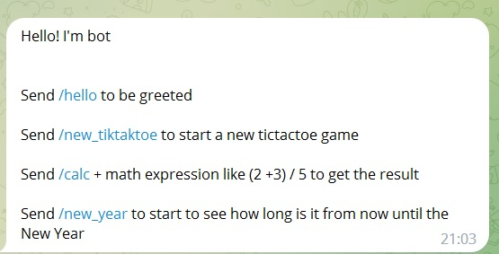
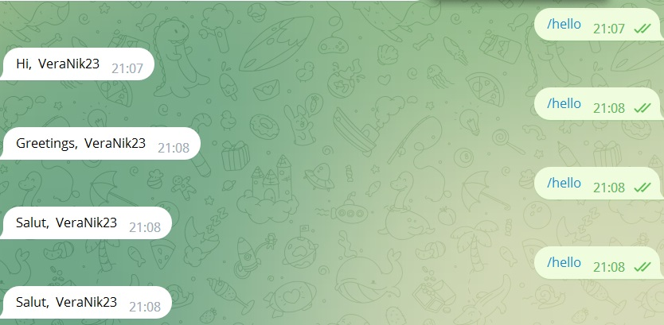
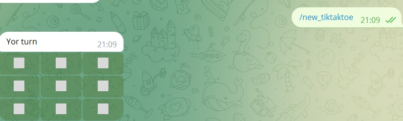
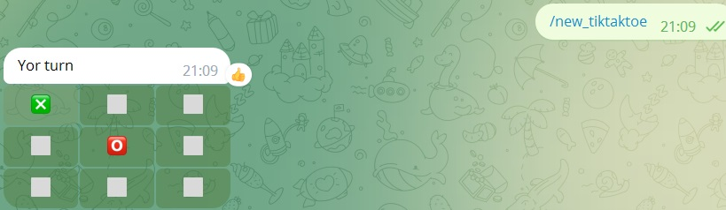
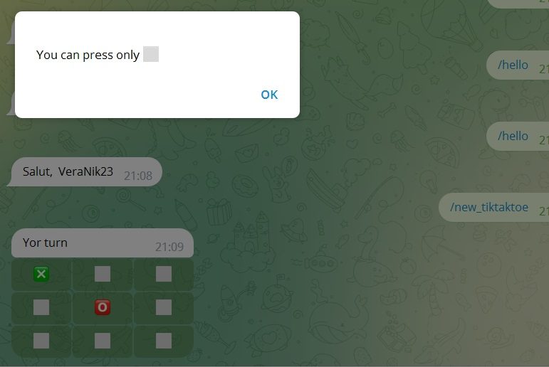
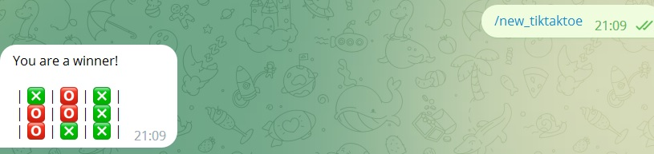
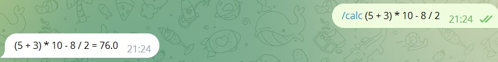
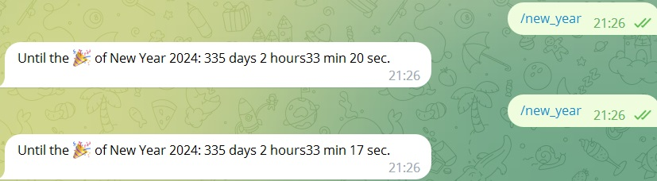

To any message you'll get the replay with the help message:

**Bot commands**

Send **/hello** to be greeted

Send **/new_tiktaktoe** to start a new tictactoe game

You'll get a clear tictactoe field

Press any button to put 'X' there and the Bot will make its choice

If you choose 'X' or 'O' field, you'll see the alarm message

At the end you'll see the result of the game

Send **/calc** + math expression like (2 +3) / 5 to get the result. For example "/calc 2 + 3* (5-11)"

Send **/new_year** to start to see how long it is from now until the New Year

